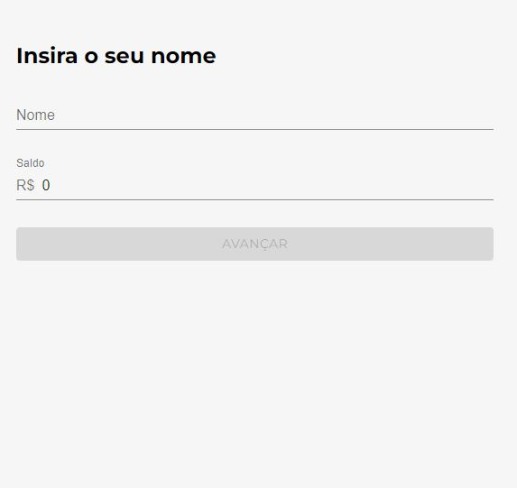
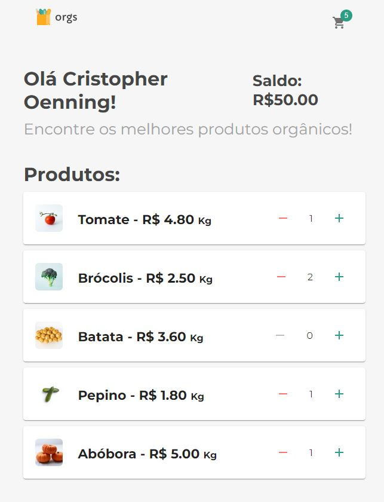
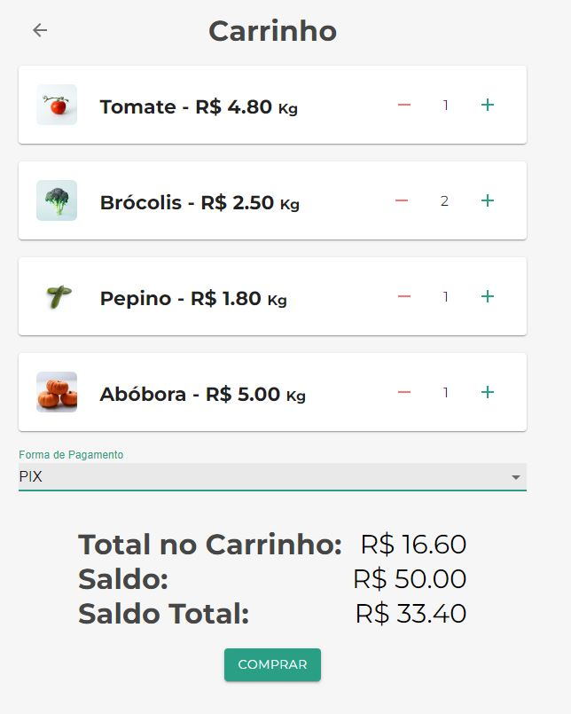

# Interactive Shopping Cart:

this is a React project that focuses on using the ContextAPI. The main objective is to create an interactive shopping cart for a virtual supermarket.

1 - Put your name and the amount available for purchase

2 - Choose the items you want to buy and click on the shopping cart in the top right corner.

3 - Choose the payment method you want to buy and click buy.
* Note: each payment method has its own built-in interest calculation. Payment method via PIX has no interest.

4 - After your purchase, your balance will decrease and if you want to make a new purchase, click on the arrow to return to the market on the arrow in the upper left corner and make a new purchase with your new balance.

# Functionalities:

* User can add their name and enter cash balance available for purchases.

* A list of products is available for selection, allowing the user to choose which products to buy and in what quantity.

* When adding products to the shopping cart, you can view the purchase total and the remaining balance available.

* The user can choose between different payment methods, each with its specific interest rate. This interest will affect the final purchase price, including the final available balance.

This project is designed to demonstrate the use of the ContextAPI in React, providing an interactive grocery shopping cart experience. It's a practical example of how to manage shared state in a React app using the ContextAPI.

Feel free to explore and customize this project to suit your specific needs. We hope this shopping cart application is helpful in understanding and applying ContextAPI concepts in React.

Have fun shopping!

# How to use:

Requires Node.Js version 18 (or higher) installed. -> https://nodejs.org/

1. Install Node.Js 18 (or higher) from the official website https://nodejs.org/, if not installed.
4. Use the command "npm i" in the terminal to install all necessary dependencies.
5. Use the command "npm start" in the terminal to open the web system in your browser in 'http://localhost:3000

# Expansion:

With this code base, you will be able to further expand the functionalities of this web system, as you will always have functionalities to add and refine errors, test, creating your own functionalities according to your needs.